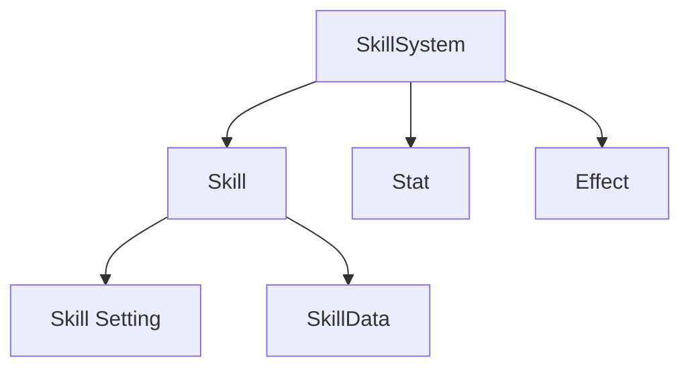

# Overview

  

복잡한 스킬들을 효과적으로 구현하기 위해 스킬 시스템을 공부하여 적용하였습니다.
모바일 게임에서의 필요한 부분은 따로 기능을 추가하며 그동안 추상적 이었던 스킬 작동 개념을 확인하고 확장이 용이한 시스템 설계에 대해 공부할 수 있었습니다.

# 시스템 개요

스킬 시스템은 크게 6개의 핵심 컴포넌트로 구성되어 있습니다. SkillSystem이 전체적인 스킬 관리와 등록/해제를 담당하고, Skill 컴포넌트가 개별 스킬의 상태와 타입(Instant/Passive/Toggle)과 같은 설정을 관리합니다.  

각 스킬의 레벨 별 설정은 SkillData에서 관리되며, TargetSearcher가 스킬의 대상을 찾고 선택하는 역할을 합니다. EffectSelector는 스킬 효과를 선택하고 적용하며, 마지막으로 SkillAction이 투사체 발사나 돌진 등 실제 스킬의 실행 로직을 처리합니다.

#### 스킬 사용 흐름

---

# Skill
## Skill Setting

단발성 즉시 적용 스킬, 지속성 스킬, 주기적 효과 적용 스킬 등 다양한 스킬을 설정할 수 있습니다.  

## Preceding Action & Action
  

Preceding Action으로 사전 행동을, Action으로 실제 스킬의 동작을 선택합니다.

Action 종류

**Spawn Projectile Action**  
  
투사체를 발사하는 스킬입니다. Editor를 통해 투사체의 속성을 세부 조정할 수 있습니다.

**Charging Rush Action**  
  
차징 후 돌진하는 스킬입니다. NavMesh 경계에 부딪히면 스턴 효과가 적용됩니다.

**Instant Apply Action**  
  
효과를 즉시 적용하는 기본 Action입니다.

## Setting 
  
스킬의 지속시간, 적용 횟수, 쿨타임을 설정합니다. 쿨타임은 스탯 시스템과 연동되어 감소 효과를 적용할 수 있습니다.

## Effect Selector
  
스킬이 사용할 효과들을 선택합니다. Setting의 설정의 결과로 Apply될 때마다 Effect들이 적용됩니다.

## Target Searcher  

**Selection Action**  
자신, 가까운 적, 특정 위치 등 스킬의 대상을 선택하는 방식을 정의합니다.

**Search Action**  
선택된 대상이나 위치를 기준으로 실제 효과를 적용할 대상을 검색합니다.

Target Searcher 예시

**Select Position By Moving Direction**은 현재 Skill의 주인이 움직이고 있는 방향을 기준으로 잡습니다.  
Select된 결과로 Search를 시작하는데 **Search Box Area**는 설정한 영역에 적이 있는지 확인합니다.

결론은 움직이고 있는 방향에 2 * 5 크기의 Box Area를 펼쳐 영역 내부의 의 적에게 스킬을 적용하게 됩니다.

## Cost & Cast & Charge
  
스킬 사용에 필요한 자원을 설정합니다.  
 

  
스킬 시전 시간을 설정합니다.  
 

  
차징 관련 설정을 합니다. 총 차징 시간, 차지가 끝나는 시간, 최소 차징 시간, 차징 시작 시간 을 조정할 수 있습니다.  

## Animation & Custom Action
  
스킬 사용 시 재생할 애니메이션을 트리거 할 Hash값을 설정할 수 있습니다.
스킬의 Apply가 발생할 때 Custom Action을 설정하여 카메라 진동과 같은 효과를 부여할 수 있습니다.

Animator

스킬에서 설정한 Hash값은 스킬이 발동될 때 적용되며 캐릭터는 애니메이션을 재생하게 됩니다.

# Stat
 
체력, 쿨타임, 이동속도 등의 기본 수치를 정의합니다. 백분율/감소 여부를 설정하여 계산 방식을 결정합니다.  
 

  
스탯 시스템을 통해 스킬의 쿨타임 감소와 같은 수치 보정이 가능합니다.

# Effect
## Setting
  
Category를 통해 효과를 분류하고, 중복 적용 규칙을 설정합니다.

## Stack & Counter Effect
  
스택 시스템을 통해 누적 효과를 구현할 수 있습니다.  
 

  
특정 효과에 대한 면역 기능을 구현합니다. (예: 슈퍼아머의 넉백 면역)

## Action
  
데미지, CC기, 스탯 증가 등 다양한 효과를 조합할 수 있습니다.

Effect Action 종류

**Stun Action**  

기존 CC를 제거하고 스턴을 적용합니다.

**Knockback Action**  

힘, 방향, 시간을 설정하여 넉백 효과를 구현합니다.

**Increase Stat Action**  

지정한 스탯의 수치를 증가시킵니다.

## Setting & Custom Action
  
효과의 지속시간, 적용 횟수를 설정하고, 화면 떨림과 같은 부가 효과를 추가할 수 있습니다.