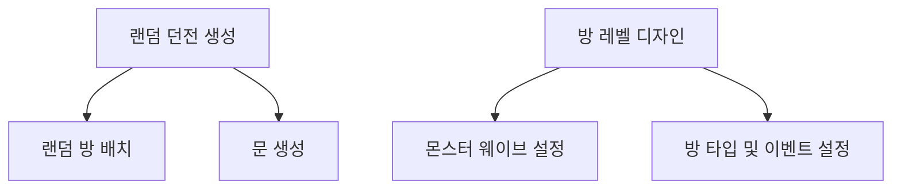

# Overview
[](https://github1s.com/hooony1324/Project_h/blob/HEAD/project_h/Assets/_Project/Scripts/Contents/Map/Dungeon/Dungeon.cs)
  

로그라이크 장르에서 사용되는 절차적 던전 생성을 고려하여 랜덤한 방 배치를 하는 시스템을 만들었고, 각 방에 대한 커스터마이징과 확장성이 용이하도록 설계하였습니다.

---


# 시스템 개요



# 랜덤 방 배치

## Isometric Grid Map
  

Isometric 맵은 통상의 정사각형 Grid Map을 Isometric 좌표 변환을 통해 표현하였습니다. 방의 패턴은 사전에 정의되는데 방이 소환되면 패턴에 따라 Isometric Grid안에 패턴을 넣었고 다음 방을 소환하면 이 패턴이 겹치는지 확인하여 방이 겹치지 않도록 소환하는 기능을 구현하였습니다.


## 방 충돌 검사 및 소환
```csharp
    enum EPattern
    {
        /// ... 생략 ... ///
        _L,
        /// ... 생략 ... ///
    }

    private Vector2Int[] GetPattern()
    {
        switch (roomPattern)
        {
            /// ... 생략 ... ///
            case DungeonRoom.EPattern._L: return new Vector2Int[] { new Vector2Int(0, 0), new Vector2Int(0, 1), new Vector2Int(0, 2), new Vector2Int(1, 0) };
            /// ... 생략 ... ///
        }
    }
```

사전에 만들어 놓은 방의 패턴입니다.  
방이 소환되면 소환 지점을 기준으로 패턴을 적용하여 Map의 Grid에 1을 채워넣습니다. _L 패턴은 원소가 4개 이므로 맵에서 20x20 * 4인 1600의 Unit을 차지하게 됩니다.

1x1패턴의 방이 소환되면 단순히 상, 하, 좌, 우 Index를 OpendList에 넣어 다음 소환 지점을 무작위로 선별합니다.
선별한 지점을 기준으로 소환될 방의 패턴을 가져와 충돌검사를 수행합니다.  
충돌 검사 성공 시 방을 소환합니다.


# 문 생성

## Kruskal 알고리즘 으로 방 연결
우선 던전의 경로에 순환이 없도록 방을 연결하고 싶었습니다.  

최종적으로 기획된 방의 개수가 많지 않았고 이웃된 방 끼리 Edge를 생성할 예정이었기 때문에 MST의 알고리즘 중 Kruska알고리즘을 사용하여 방을 연결하였습니다.

```csharp
private void GenerateDoors()
{
    // 방 연결, MST
    CreateEdges();
    InitializeUnionFind();

    // 연결을 확인하며 문 생성
    foreach (var edge in _edges)
    {
        DungeonRoom roomA = edge.RoomA;
        DungeonRoom roomB = edge.RoomB;

        if (FindRoot(roomA) != FindRoot(roomB))
        {
            // UnionFind 알고리즘
            Union(roomA, roomB);
            PlaceDoorsBetweenRooms(roomA, roomB);
        }
    }
}
```

## 연결된 방 사이에 문 설치
  
방의 연결이 발생할 때마다 문을 양 쪽에 설치하였고, 대부분 크기가 다른 방의 연결이었기 때문에 문의 입구와 출구가 자연스럽게 바라보도록 별도의 알고리즘을 구현하였습니다.  

<br>
Dungeon.cs - PlaceDoorsBetweenRooms()  
[](https://github1s.com/hooony1324/Project_h/blob/HEAD/project_h/Assets/_Project/Scripts/Contents/Map/Dungeon/Dungeon.cs#L244)
