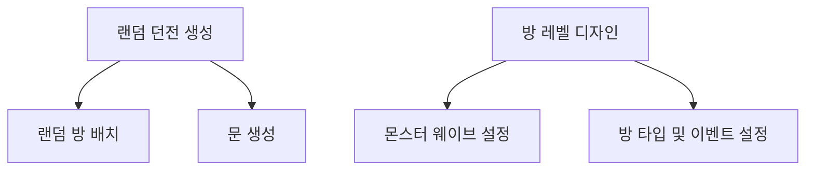

# Overview
[](https://github1s.com/hooony1324/Project_h/blob/HEAD/project_h/Assets/_Project/Scripts/Contents/Map/Dungeon/Dungeon.cs)
  

플레이어가 던전에 입장할 때마다 모습이 다른 부분을 표현하고 싶었습니다. 기획자가 각 방의 특징을 설정할 수 있고 방의 모양을 커스터마이징 할 수 있도록 설계하였습니다.

---


# 시스템 개요



# 랜덤 던전 생성

  

Isometric 맵은 통상의 정사각형 Grid Map을 Isometric 좌표 변환을 통해 표현하였습니다.  

## 랜덤 방 배치

(2, 2)에 1x1패턴의 방이 소환되면 단순히 LeftTop, RightTop, LeftBottom, RightBottom 위치의 Index를 OpendList에 넣어 다음 소환 지점을 무작위로 선별합니다.  

선별한 지점을 기준으로 소환될 방의 패턴을 가져와 충돌검사를 수행합니다. 충돌 검사 성공 시 방을 소환합니다.

##### 방 배치 시 충돌검사
```csharp
    enum EPattern
    {
        /// ... 생략 ... ///
        _L,
        /// ... 생략 ... ///
    }

    private Vector2Int[] GetPattern()
    {
        switch (roomPattern)
        {
            /// ... 생략 ... ///
            case DungeonRoom.EPattern._L: return new Vector2Int[] { new Vector2Int(0, 0), new Vector2Int(0, 1), new Vector2Int(0, 2), new Vector2Int(1, 0) };
            /// ... 생략 ... ///
        }
    }
```

사전에 정의된 방의 패턴입니다.  
방이 소환되면 패턴에 해당하는 Grid의 영역이 1로 채워지게 되며
새로운 방이 소환 되면, 소환 지점을 기준으로 방의 패턴을 가져와서 방 끼리 충돌하는 지의 여부를 판단합니다.


##  문 생성

##### Kruskal 알고리즘 으로 방 연결
우선 던전의 경로에 순환이 없도록 방을 연결하고 싶었습니다.  

최종적으로 기획된 방의 개수가 많지 않았고 이웃된 방 끼리 Edge를 생성할 예정이었기 때문에 MST의 알고리즘 중 Kruska알고리즘을 사용하여 방을 연결하였습니다.

```csharp
private void GenerateDoors()
{
    // 방 연결, MST
    CreateEdges();
    InitializeUnionFind();

    // 연결을 확인하며 문 생성
    foreach (var edge in _edges)
    {
        DungeonRoom roomA = edge.RoomA;
        DungeonRoom roomB = edge.RoomB;

        if (FindRoot(roomA) != FindRoot(roomB))
        {
            // UnionFind 알고리즘
            Union(roomA, roomB);
            PlaceDoorsBetweenRooms(roomA, roomB);
        }
    }
}
```

##### 연결된 방 사이에 문 설치
Dungeon.cs - PlaceDoorsBetweenRooms()  
[](https://github1s.com/hooony1324/Project_h/blob/HEAD/project_h/Assets/_Project/Scripts/Contents/Map/Dungeon/Dungeon.cs#L244)  
  
방의 연결이 발생할 때마다 문을 양 쪽에 설치하였고, 대부분 크기가 다른 방의 연결이었기 때문에 문의 입구와 출구가 자연스럽게 바라보도록 알고리즘을 구현하였습니다.  

빨간색 경계로 보이는 마름모 1개가 맵의 단위 이며 연결된 두 방 사이에는 무조건 맞닿는 마름모를 1개씩 가지고 있습니다. A와 B마름모가 있다고 했을 때 중심으로 부터 서로를 향하는 방향으로 문을 설치하는 것이 알고리즘의 내용입니다.


# 방 레벨 디자인
  
방의 모양, 몬스터 웨이브 정보, 인게임 시 방의 입장/퇴장 시 사용하고 싶은 이벤트를 설정하여 각 방마다 기획자가 디자인을 할 수 있도록 구현하였습니다.

## 몬스터 웨이브 설정
  
Tilemap을 이용하여 소환할 몬스터와 소환 위치를 지정하였습니다.

MonsterWaves오브젝트 자식에 'Tilemap_Wave'처럼 Tilemap을 추가하는 것을 몬스터 웨이브 1개로 취급하였습니다. 각 웨이브에 원하는 위치에 몬스터 타일을 배치하여 관리됩니다.  

<br>

  
각 웨이브 시간 설정과 강제 진행 여부 설정입니다.

Force Spawn After Duration 체크 시 Wave Duration List에 각 웨이브의 시간제한을 설정할 수 있습니다. 설정한 시간이 지나면 다음 웨이브가 강제로 시작됩니다.

설정 체크를 해제하면 각 웨이브의 몬스터를 전부 처치하면 다음 웨이브로 진행되는 방식입니다.


## 방 타입 및 이벤트 설정
  
방의 입장, 퇴장, 웨이브 클리어 시 에 Event를 바인딩 할 수 있도록 구현하였습니다. 웨이브 클리어 시, 방 중앙에 아이템 소환과 같은 형태의 방을 기획 할 수 있습니다.